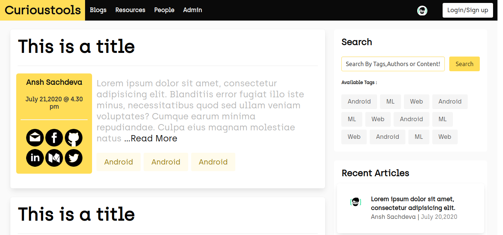
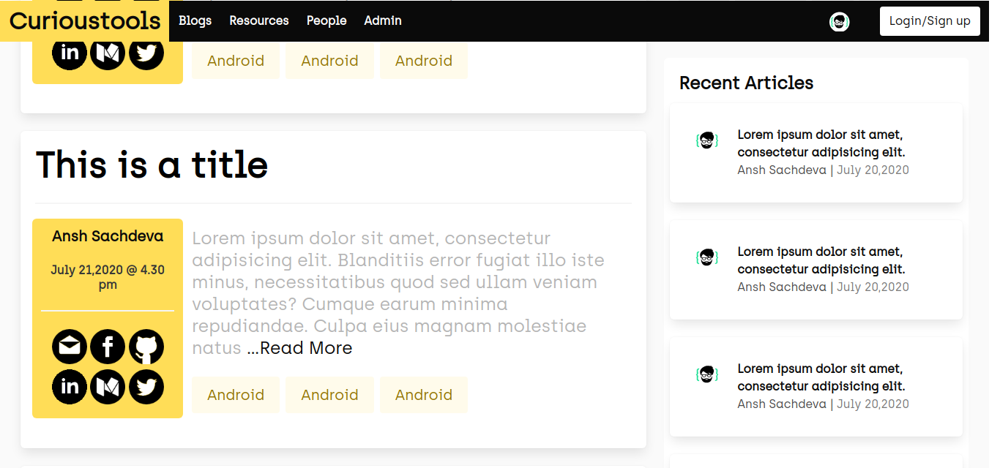
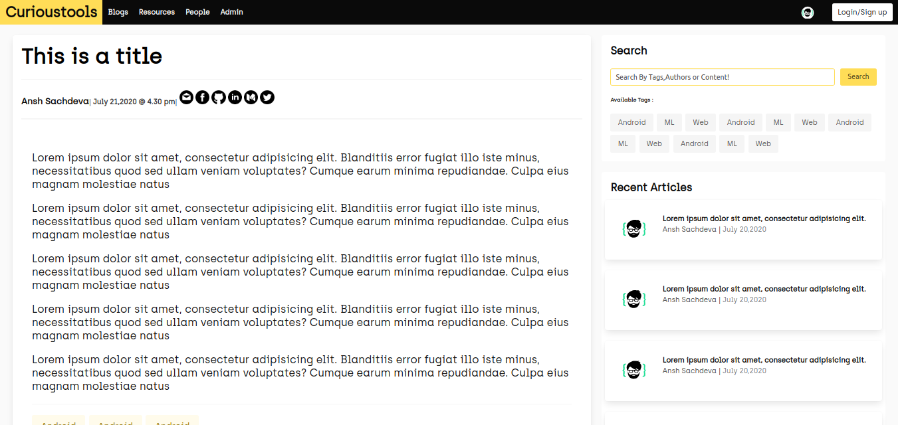
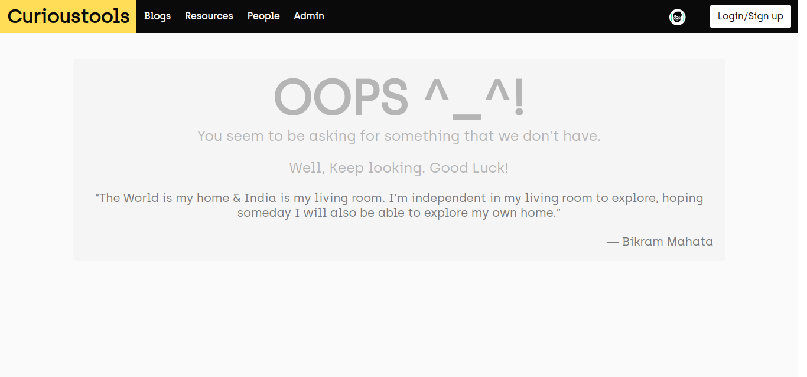

# Blog CMS (in PHP)

### About
I have been learning php and a lil bit of front end for last one month.  
This is supposed to be a full scale Content Management System with whole features of a full fledged blogging website

### Tech Stack
- Bulma | php | JS/Jquery | HTML 

### features

(Expected):  

- [ ] dynamic blog retrieval from the db
- [ ] admin cms
- [ ] resource center
- [ ] public/private profile with editing feature
- [ ] forgot assword mechanism
- [ ] search by content, author,blog title or tags

(currently available):  

- [x] ui of home page and blog page
- [x] ui of login/register
- [x] 404

### Setup

1. [install xampp server](https://www.apachefriends.org/download.html).
2. go to `htdocs ` folder
3. `git clone` this repo there
4.  run on browser as [http://localhost/CMS/src ](http://localhost/CMS/src )

### Preview :

### Screenshots :

  

  

  

