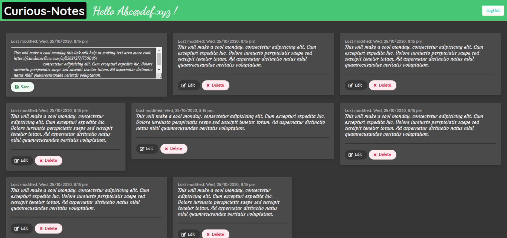
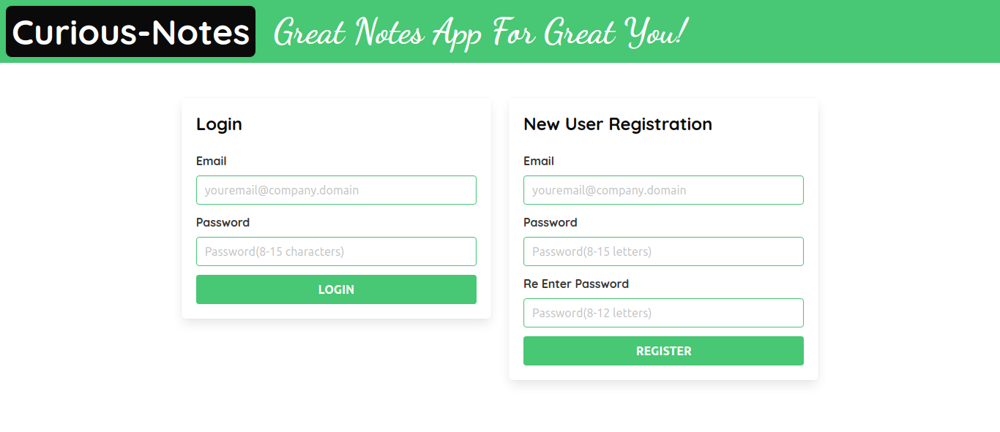

#Curious-notes  [inc]

This was supposed to be a simple and responsive  notes web app where user can login/signup , store its notes and logout.  

The server is made using mysql and php, and frontend is made using vanilla html/css/js and bulma.css . The comunication was supposed to be done via ajax. 

I got stuck in the frontend part, otherwise the backend is working fine.will try to complete some other day.  

snaps:  

